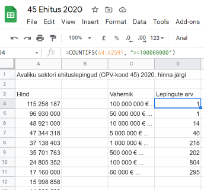

# Avaandmete-POC

Avaandmete-POC on vahend Riigihangete registri (RHR) avaandmete töötlemiseks.

## Kood

- `LAE_AASTA.sh` laeb Riigihangete registrist argumendina määratud aasta kõigi
kuude avaandmete failid "Sõlmitud lepingud".

- `KUU.sh` moodustab skriptiga `LAE_AASTA.sh` moodustatud failist CSV-faili.

- `SIDURDA.sh` ühendab skriptiga `KUU.sh` moodustatud CSV-failid üheks, tervet
aastat hõlmavaks CSV-failiks.

- `AASTA.sh` teeb skriptide `KUU.sh` ja `SIDURDA.sh` töö ühe sammuga.

## Andmed

Avaandmed-POC abil töödeldud andmehulgad:

- [Avaliku sektori ehitushanked 2020](https://docs.google.com/spreadsheets/d/1Ajj3IH5GMpa12wEFf53G62xtkWT0__N8fv3bMXF_O54/edit?usp=sharing) - CPV-kood 45xx,
sõlmitud lepingud. Google Docs tabel, juurdepääs: vaatamisõigus.

- [Riigi IT-teenuste hanked 2020](https://docs.google.com/spreadsheets/d/199FBDvMDKyIWTbPbE8EPhr5sHBfRtZufusevGoyIyxU/edit?usp=sharing) - CPV-kood 72xx,
sõlmitud lepingud. Google Docs tabel, juurdepääs: vaatamisõigus.

Töötluse näide:

## Allikas

- [Teave Riigihangete registri avaandmete kohta](https://riigihanked.riik.ee/rhr-web/#/open-data)
- [Avaandmete kohta lisateave reliisiteade](https://www.rahandusministeerium.ee/sites/default/files/erhri_versioon_4.6_tootes_12.08.2020.pdf)

## Kasutatud vahenditest

- [XMLStarlet Command Line XML Toolkit](http://xmlstar.sourceforge.net/overview.php)
- `sudo apt install xmlstarlet`  (paigaldamine)
- `http://xmlstar.sourceforge.net/doc/UG/index.html`  (User's Guide)
- XML Path Language (XPath). Version 1.0. W3C Recommendation 16 November 1999 (Status updated October 2016) `https://www.w3.org/TR/1999/REC-xpath-19991116/` 
